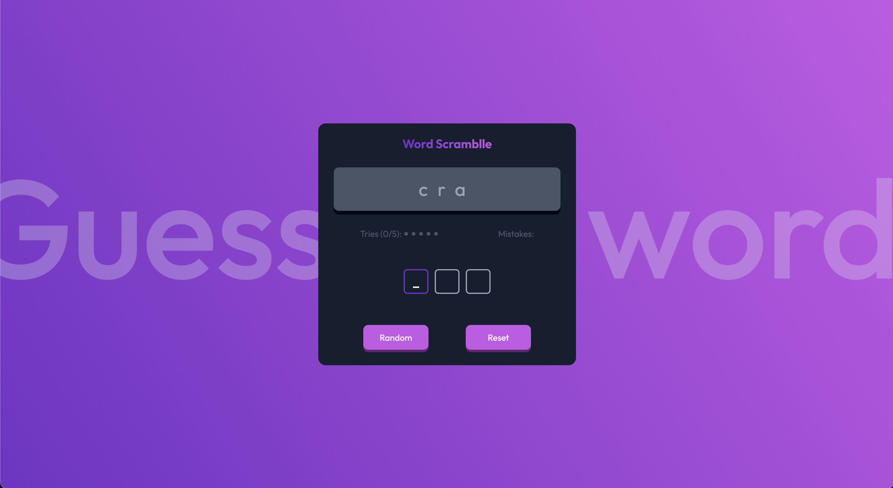

# devchallenges - Guess The Word Game solution

This is a solution to the [Guess The Word Game solution](https://devchallenges.io/challenge/guess-the-word). This challenge is to create a small game that tests your data management and DOM manipulation with JavaScript.

## Table of contents

- [Overview](#overview)
    - [User Story](#User-Story)
    - [Screenshot](#screenshot)
    - [Links](#links)
- [My process](#my-process)
    - [Built with](#built-with)
    - [What I learned](#what-i-learned)
    - [Continued development](#continued-development)
    - [Useful resources](#useful-resources)
- [Author](#author)
- [Acknowledgments](#acknowledgments)


## Overview

### User Story

Users should be able to:

- Create a guess the word game that matches the given design.
- Use HTML to create the basic structure.
- Use Vanilla JavaScript to add interactivity.
- Users can see a random scrambled word when the page is first loaded or after users click the random button.
- Users can enter one letter at a time. After each attempt, the input should automatically focus on the next input if it exists.
- Users can see the number of wrong answers (tries) and which answers are wrong (mistakes).
- Users can regenerate a new scrambled word by selecting the random button.
- Users can reset all inputs, mistakes, and tries by selecting the reset button.
- When the number of tries or mistakes reaches 6, the game should be reset.
- When the user completes the game, it should show a '🎉 Success' alert.
- The page should be responsive on different screen sizes.
- Deploy the solution and submit Repository URL and Demo URL.

### Screenshot



### Links

- Solution URL: https://github.com/amjadsh97/word-scramble
- Live Site URL: https://word-scramble-rho.vercel.app/

## My process

### Built with

- Semantic HTML5 markup
- CSS.
- Vanilla JS.


### What I learned


```js
//Function to handle the keyborad input and make sure its valid value.
function handleKeyPress(event) {
	const key = event.key.toLowerCase();
	if (key.length === 1 && key.match(/[a-zA-Z]/)) {

		if (key === guessedWord[currentIndex]) {
			letterElements[currentIndex].innerText = key;
			currentIndex++;
			updateActiveLetter(currentIndex);
			if (currentIndex === guessedWord.length) {
				showWinnerMessage();
			}
		} else {
			userTries.push(key);
			userMistakes.push(key);
		}
		if (userMistakes.length > MAX_NUMBER_OF_TRIES_AND_MISTAKES || userTries.length > MAX_NUMBER_OF_TRIES_AND_MISTAKES) {
			handleResetButtonClick();
		}

		updateTriesAndMistakes()
	}
}

//function to get shuffled word
function shuffleWord(word) {
	return word.split('').sort(() => 0.5 - Math.random()).join('');
}

```

### Continued development

In the future, I will prioritize further developing my skills in making the user experience
more seamless and intuitive by focusing on responsive design principles. I aim to delve
deeper into backend development, especially database management and user authentication,
to enhance the functionality and security of the applications I build.


### Useful resources

- [Animate css package](https://animate.style/) - A cross-browser library of CSS animations. As easy to use as an easy thing.


## Author

- Website - [Amjad Shadid](https://amjadshadid.vercel.app/)
- Frontend Mentor - [@amjadsh97](https://www.frontendmentor.io/profile/amjadsh97)
- devchallenges - [Amjad Shadid](https://devchallenges.io/profile/421f394d-f24a-481a-90e9-c80e07f1641a)
- Twitter - [@Amjadshadid](https://twitter.com/Amjadshadid)
- Linkedin - [@Amjad Shadid](https://www.linkedin.com/in/amjad-shadid-134355134/)